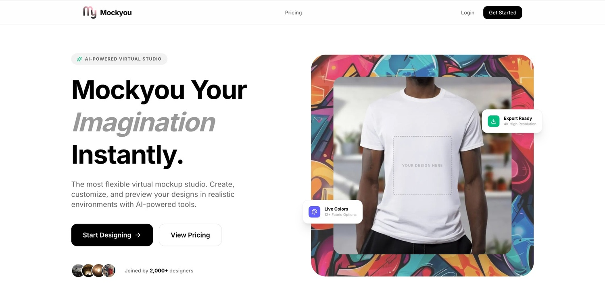
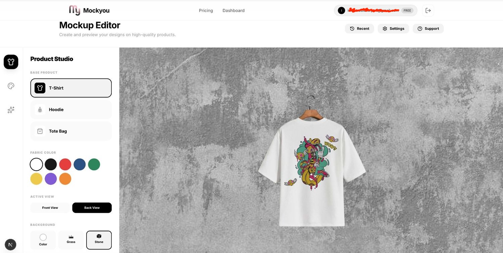
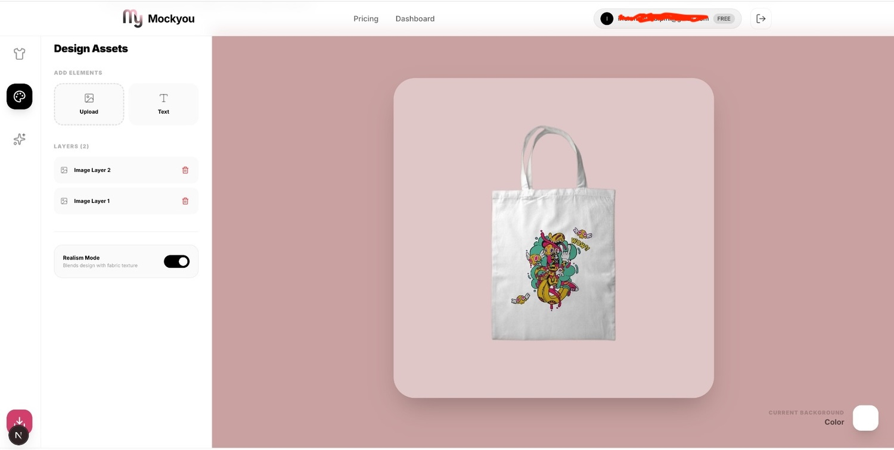

# **MOCKyou** - On Development
Simple mock up generator, including: 
- Tshirt 
- Hoodie 
- Totebag 
- Customize Background

## Soon
- Generated Mockup via AI

## Run Locally

**Prerequisites:**  Node.js

1. Install dependencies:
   `npm install`
2. Set the `GEMINI_API_KEY` in [.env.local](.env.local) to your Gemini API key
3. Run the app:
   `npm run dev`

## Screenshot

